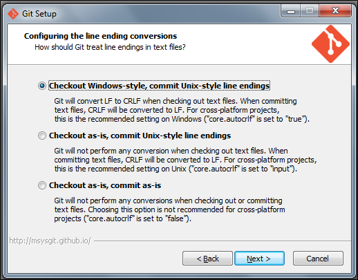

# Installation

## Install git

[`http://git-scm.com/downloads`](http://git-scm.com/downloads)

Once again ensure that you choose the correct binary for your system.

On **Windows** platform choose to **use GIT from the command prompt**.

On **Windows** platform choose to **checkout Windows-style, commit Unit-style** for line endings.

## Install node.js

[`http://nodejs.org/download/`](http://nodejs.org/download/)

Ensure that you choose the correct binary for your system. Meaning that 64 bit systems should choose the 64 bit binary.

Choose the **default settings** whenever prompted.

On **Windows** platform the installer will add a **path** entry to node. For that to be active you will most likely need
to reboot. Once you can see node in the console `echo %PATH%` then you are ready.

## or Update npm

Unless you just installed `node` you may be running npm older than **npm 2.0.0**. In that case it is worth updating.

    npm install -g npm

On windows you may have some difficulty and should follow the troubleshooting
[instructions](https://github.com/npm/npm/wiki/Troubleshooting#upgrading-on-windows) from the outset.

Be aware however that npm 2 has [**breaking changes**](http://blog.npmjs.org/post/98131109725/npm-2-0-0) for existing
projects.

## Install Bower

Most angularity projects want to utilise [bower](http://bower.io/). Perform a global installation using npm.

    npm install -g bower

## Install Angularity

### Stable

Perform a global installation using npm.

    npm install -g angularity

### Pre-release

You can install from github. However this is considered bleeding edge.

    npm install -g angularity/node-angularity

## [optional] Angularity Source Code

If you wish to develop or contribute to the Angularity project you will need to [fork the project]([https://github.com/angularity/node-angularity/fork](https://github.com/angularity/node-angularity/fork) on github.

Get local a working copy of your fork.

    git clone git@github.com:<YOUR_GITHUB_USERNAME>/node-angularity.git

Force the global install to defer to this working copy.

    npm link

Be sure to keep your fork in sync with the main repository before you start working on any patch. This [how to on Github](https://help.github.com/articles/syncing-a-fork/) is most helpful.
