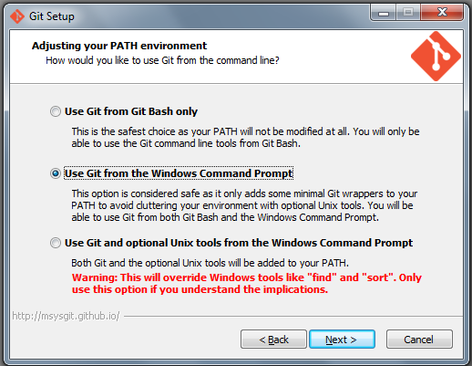
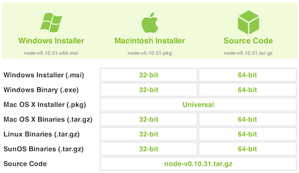

# Installation

## Install git

[`http://git-scm.com/downloads`](http://git-scm.com/downloads)

Once again ensure that you choose the correct binary for your system.

On **Windows** platform choose to **use GIT from the command prompt**.

On **Windows** platform choose to **checkout Windows-style, commit Unit-style** for line endings.

## Install node.js

[`http://nodejs.org/download/`](http://nodejs.org/download/)

Ensure that you choose the correct binary for your system. Meaning that 64 bit systems should choose the 64 bit binary.

Choose the **default settings** whenever prompted.

On **Windows** platform the installer will add a **path** entry to node. For that to be active you will most likely need
to reboot. Once you can see node in the console `echo %PATH%` then you are ready.

## or Update npm

Unless you just installed `node` you may be running npm older than **npm 2.0.0**. In that case it is worth updating.

    npm install -g npm

On windows you may have some difficulty and should follow the troubleshooting
[instructions](https://github.com/npm/npm/wiki/Troubleshooting#upgrading-on-windows) from the outset.

Be aware however that npm 2 has [**breaking changes**](http://blog.npmjs.org/post/98131109725/npm-2-0-0) for existing
projects.

## Installation

You will need to install bower, and update npm.

    npm install -g bower
    npm install -g npm

Next, we will install angularity.
Decide whether you wish to use the last stable release,
the latest commit,
and if you wish to contribute to the project,
and follow the appropriate set of instructions below.

###  Stable

The default installation is fairly straightforward.
Installing `npm` simply updates it,
and Angularity expects bower to be available globally.

    npm install -g angularity

If you wish to install a particular release of angularity,
you can install from github instead of the npm registry, like so:

    npm install -g angularity/node-angularity#0.0.18

(replace `0.0.18` with the tag you wish to use)

###  Latest

For those who wish to live on the bleeding edge,
you will need to symlink the global npm package to
somewhere.

Assuming `CODE` is a folder where you place your code checkouts,
and `NODE` is a folder where NodeJs is installed

    npm install -g angularity
    cd ${CODE}
    git clone git@github.com:angularity/node-angularity.git
    mv node-angularity angularity
    cd ${NODE}/lib/node_modules
    mv angularity angularity.backup
    ln -s ${CODE}/angularity angularity
    cd ${CODE}/angularity
    npm install

###  Contributor

If you wish to develop or contribute to the Angularity project,
set up your git checkout to do so.

Firstly, fork the project on github:
[https://github.com/angularity/node-angularity/fork](https://github.com/angularity/node-angularity/fork)

Then run these commands to clone your forked repository,
and then link it from NodeJs' global folder.

    npm install -g angularity
    cd ${CODE}
    git clone git@github.com:${GITHUB_USERNAME}/node-angularity.git
    mv node-angularity angularity
    cd ${NODE}/lib/node_modules
    mv angularity angularity.backup
    ln -s ${CODE}/angularity angularity
    cd ${CODE}/angularity
    git remote add upstream git@github.com:angularity/node-angularity.git
    npm install

Be sure to keep your fork in sync with the main repository
before you start working on any patch.
This [how to on Github](https://help.github.com/articles/syncing-a-fork/)
is most helpful.
